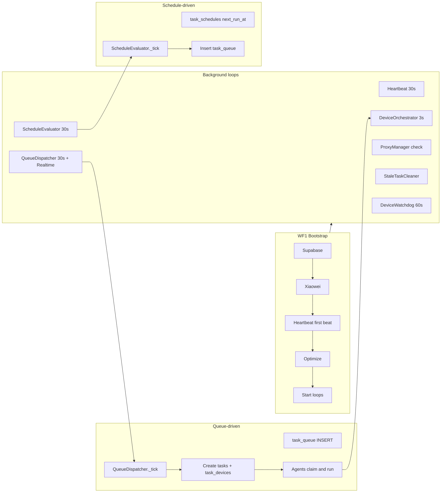

# 워크플로우 모듈 매핑 및 실행 모델 (Workflow Modules Mapping & Execution Model)

워크플로우 정의는 [WORKFLOWS.md](WORKFLOWS.md) 참조. 이 문서는 **모듈 ↔ JS 파일** 매핑, **실행 모델**, **구현 현황**, **폴더·명명 규칙**, **모듈 휴식(딜레이)** 를 정리한다.  
에이전트 실행 SSOT: **apps/desktop/src/agent** (root `agent/`는 standalone/legacy).

---

## 1. 모듈 ↔ JS 파일 매핑

### Workflow 1: Bootstrap

| Step | Condition | Module | JS file (agent) |
|------|-----------|--------|-----------------|
| Supabase connect | PARALLEL | verifyConnection | `core/supabase-sync.js` |
| WebSocket connect | PARALLEL | XiaoweiClient + waitForXiaowei | `core/xiaowei-client.js`, `agent.js` |
| Device serial/IP | WAIT | list + resolveHardwareSerialsForList | `device/heartbeat.js`, `device/device-serial-resolver.js` |
| Device diff update | WAIT | batchUpsertDevices | `core/supabase-sync.js` (heartbeat에서 호출) |
| Device optimize | PARALLEL | presets.optimize | `device/device-presets.js` |
| Agent run | WAIT | startHeartbeat, deviceOrchestrator.start 등 | `agent.js`, `device/heartbeat.js`, `device/device-orchestrator.js` |

### Workflow 2: Per-device setup

| Step | Condition | Module | JS file |
|------|-----------|--------|---------|
| Proxy check/assign | SKIP/WAIT | loadAssignments, applyAll | `setup/proxy-manager.js` |
| Account check/assign | SKIP/WAIT | loadAssignments, verifyAll | `setup/account-manager.js` |

### Workflow 3: Warmup

| Step | Condition | Module | JS file |
|------|-----------|--------|---------|
| Keyword generation | WAIT | (external) | Web/API; 에이전트 JS 없음 |
| w.task / task_devices | WAIT | task_queue → tasks + task_devices | Web API + `scheduling/queue-dispatcher.js`, `orchestrator/models.js` |
| Round-robin assign | PARALLEL | claim_task_devices_for_pc | `device/device-orchestrator.js` |
| Search / select / watch / actions | WAIT/PARALLEL | _buildSearchQuery, _searchAndSelectVideo, _watchVideoOnDevice, _doLike/_doComment/담기 | `task/task-executor.js` |
| Preset warmup path | (branch) | presets.warmup | `device/device-presets.js` (orchestrator free_watch 시) |

### Workflow 4: Task watch

| Step | Condition | Module | JS file |
|------|-----------|--------|---------|
| Cron / new videos | WAIT | task_schedules or task_queue | `scheduling/schedule-evaluator.js`, `scheduling/queue-dispatcher.js` |
| task/task_device create | WAIT | insert task + task_devices | `orchestrator/models.js`, queue-dispatcher or API |
| Search / play / 6s ad skip / actions | WAIT/PARALLEL | WF3 동일 + 광고 스킵 | `task/task-executor.js` |

### Workflow 7: Logging

| Step | Condition | Module | JS file |
|------|-----------|--------|---------|
| Event collect | WAIT | (WebSocket/webhook) | Web dashboard (API) — 에이전트 없음 |
| Complete verdict + screenshot | WAIT | takeScreenshotOnComplete, logs | `device/screenshot-on-complete.js`; 판정 로직은 웹 |

### Workflow 8: Content & channel

| Step | Condition | Module | JS file |
|------|-----------|--------|---------|
| Content register / channel 1min check / video collect | WAIT/PARALLEL | (web/API, cron) | Web + sync-channels-runner 등; 에이전트 채널 폴러 없음 |
| task_device create + AI comments | PARALLEL | comment-generator, queue/models | `setup/comment-generator.js`, `orchestrator/models.js` |
| Complete storage / 18-device next request | WAIT | claim + dashboard | `device/device-orchestrator.js`; "다음 요청"은 웹 |

---

## 2. 실행 모델 (Execution model)

- **One-off (WAIT chain):** WF1은 `main()`에서 Supabase → Xiaowei → 첫 heartbeat(디바이스 목록 + batchUpsert) → optimize → 모든 interval 시작. 현재 코드는 병렬 없이 순차.
- **Background (PARALLEL after bootstrap):** Heartbeat(30s), DeviceOrchestrator(3s), QueueDispatcher(30s + Realtime), ScheduleEvaluator(30s), ProxyManager check, StaleTaskCleaner, DeviceWatchdog(60s). 공통 workflow id 없이 각 컴포넌트가 독립 실행.
- **Queue-driven:** `task_queue`(status=queued) → QueueDispatcher가 조회 → orchestrator/models로 `tasks` + `task_devices` 생성 → 에이전트가 `claim_task_devices_for_pc`로 claim 후 `runTaskDevice` 실행. WF3/WF4는 동일 task_devices 소비; 구분은 데이터의 task_config/workflow 타입.
- **Schedule-driven:** `task_schedules`(next_run_at ≤ now) → ScheduleEvaluator가 `task_queue`에 insert → 위와 동일 queue 경로.
- **의존관계:** WF1 완료 후 WF2(디바이스 셋업) 및 claim(WF3/WF4) 가능. WF2는 Xiaowei 연결 후 main()에서 실행. WF3/WF4는 task_devices 존재 시 (웹, queue-dispatcher, schedule-evaluator가 생성). WF7/WF8는 하이브리드: 에이전트는 스크린샷·실행 로그 제공; 웹은 이벤트 집계, 판정, 채널 체크, "다음 20" 요청.

---

## 3. 구현 현황 (Implementation audit)

| Workflow / Step | Implemented (Y/N) | Location / note |
|-----------------|-------------------|------------------|
| WF1 all | Y | agent.js + core/ + device/heartbeat, device-presets |
| WF2 proxy/account | Y | setup/proxy-manager.js, setup/account-manager.js |
| WF3 keyword gen | N | 외부/API 문서화; 에이전트 JS 없음 |
| WF3 w.task creation | Partial | queue-dispatcher + models; "w.task" 명명·확률 스냅샷은 API/DB |
| WF3 round-robin + search/watch/actions | Y | device-orchestrator(claim) + task-executor |
| WF3 preset warmup | Y | device-presets.warmup (orchestrator free_watch) |
| WF4 Cron / task create | Y | schedule-evaluator, queue-dispatcher, orchestrator/models |
| WF4 6s ad skip | Audit | task-executor에 명시적 6초 광고 스킵 없음; 추가 또는 TODO 문서화 |
| WF4 30s min gap between actions | Partial | likeAtSec 등 시청 구간 내 랜덤; "30초 미만 시 뒤로 미룸" 미구현 |
| WF7 event collect + verdict | Web | 대시보드; 에이전트는 로그·스크린샷만 전송 |
| WF7 screenshot on complete | Y | device/screenshot-on-complete.js |
| WF8 channel 1min check / video collect | Web | sync-channels-runner 등; 에이전트 1분 폴러 없음 |
| WF8 task_device + AI comment | Partial | comment-generator 있음; "260303_2_34_제목" ID·일괄 댓글은 API/DB |
| WF8 "18 devices → request next" | Partial | 웹 또는 오케스트레이터 로직; 에이전트는 maxConcurrent(20)까지 claim |

**Action items:** task-executor에 6s ad skip 추가 또는 TODO 명시; 액션 간 30초 미만 시 뒤로 미루는 로직 추가 검토; w.task 스키마 API 문서화.

---

## 4. 오케스트레이터 결정 (Option B)

- **채택:** Option B — 현재 구조 유지 + 워크플로우 인덱스 문서화 및 (선택) task_config에 workflow_id로 추적.
- **선택 사항:** thin `workflows/bootstrap.js`로 WF1 단계만 명시적으로 순서 호출하고, agent.js에서 해당 러너 호출. WF3/WF4 실행 경로는 변경 없음(claim + runTaskDevice). 구현: `workflows/bootstrap.js`에 `runBootstrapSteps(config, steps)` 제공 (각 step 사이에 `delayBetweenModules` 적용).

---

## 5. 폴더·명명 규칙

- **유지:** `core/`, `device/`, `task/`, `scheduling/`, `setup/`, `lib/`, `orchestrator/` 를 메인 구현으로 유지.
- **추가:** `workflows/` — 문서(README 등) 및 선택적으로 `workflows/bootstrap.js` 등 thin runner. 기존 파일 이동 없음.
- **명명:** `*-manager.js`, `*-presets.js`, `*-executor.js`, `*-orchestrator.js`, `*-dispatcher.js`, `*-evaluator.js` 유지. 새 파일은 필요 시 `workflows/wf01-bootstrap.js` 등.
- **정리:** `common copy/` 제거 또는 `common/`과 통합; `device-unused/`, `task-unused/`는 deprecated 또는 `_archive`로 이동 후 참조 갱신.

---

## 6. 모듈 휴식 (module_min_delay_ms, module_max_delay_ms)

각 모듈 실행 전에 **랜덤한 ms 휴식**을 둔다. 다른 전역 설정과 동일하게 **클라이언트(웹 대시보드)에서 설정 가능**하며, **최소 딜레이(ms)**와 **최대 딜레이(ms)** 사이에서 균일 랜덤으로 sleep 후 다음 단계로 진행한다.

- **설정 키 (settings 테이블):** `module_min_delay_ms` → config.moduleMinDelayMs (기본 **1500**), `module_max_delay_ms` → config.moduleMaxDelayMs (기본 **4000**).
- **구현:** `lib/module-delay.js`의 `delayBetweenModules(config)` — config에서 min/max 읽어 `sleep(rand(min,max))`. 모듈 경계(bootstrap 단계, device-orchestrator 배정, task-executor 서브 단계 등)에서 `await delayBetweenModules(config)` 호출.
- **클라이언트:** `settings` 테이블에 `module_min_delay_ms`, `module_max_delay_ms` 행 추가·수정 가능, 기존 설정 UI와 동일하게 "최소 딜레이(ms)", "최대 딜레이(ms)" 표시. Realtime으로 config 갱신 시 에이전트에 반영.

자세한 적용 위치는 코드 내 주석 및 [WORKFLOWS.md](WORKFLOWS.md) 참조.
