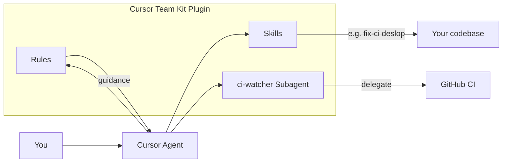

# How the Cursor Team Kit Plugin Works

## What it is

**Cursor Team Kit** is an official Cursor plugin that bundles internal workflows used by Cursor developers. It covers the full dev loop: CI monitoring and fixing, PR creation, merge conflict resolution, smoke tests, compiler checks, code cleanup, and work summaries.

In this project it is **enabled** in [`.cursor/settings.json`](../.cursor/settings.json) under `plugins.cursor-team-kit.enabled: true`.

---

## How Cursor plugins work (mechanism)

Plugins are **distributable bundles** that extend the Cursor agent. When you install and enable a plugin, Cursor loads its components and makes them available to the agent (and to you via settings and chat).

| Component              | Role                                                                                                             |
| ---------------------- | ---------------------------------------------------------------------------------------------------------------- |
| **Rules**              | Persistent AI guidance (e.g. coding standards); can be Always / Agent Decides / Manual                           |
| **Skills**             | Specialized capabilities; agent can apply when relevant or you invoke with `/skill-name`                         |
| **Agents (subagents)** | Specialized agents the main agent can delegate to; run in separate context, optionally in parallel or background |
| **Commands**           | Agent-executable command files                                                                                   |
| **MCP Servers**        | External tools/data (Model Context Protocol)                                                                     |
| **Hooks**              | Scripts triggered by events                                                                                      |

Plugin source: [cursor/plugins](https://github.com/cursor/plugins) (GitHub). Marketplace entry: [Cursor Team Kit](https://cursor.com/marketplace/cursor/cursor-team-kit).

---

## What Cursor Team Kit provides

### 1 subagent

- **ci-watcher** — Watches GitHub CI for the current branch; reports pass/fail and relevant failure logs. Use when waiting for CI, when CI has failed, or proactively to monitor branch CI. The main agent can delegate to this subagent (e.g. "check CI" or "fix CI"); it runs in its own context so CI logs don't clutter the main chat.

### 2 rules

- **no-inline-imports** — Keep imports at the top of the file; avoid inline imports.
- **typescript-exhaustive-switch** — Use exhaustive switch handling for TypeScript unions and enums.

These appear under **Rules** in Cursor Settings. You can set each to Always, Agent Decides, or Manual.

### 11 skills (examples; 6 more in the plugin)

- **check-compiler-errors** — Run compile and type-check commands and report failures.
- **deslop** — Remove AI-generated "slop" and clean up code style.
- **fix-ci** — Find failing CI jobs, inspect logs, and apply focused fixes.
- **fix-merge-conflicts** — Resolve merge conflicts non-interactively, validate build/tests, and finalize resolution.
- **get-pr-comments** — Fetch and summarize review comments from the active PR.

Skills show up in the **Agent Decides** section (and can be invoked with `/skill-name` in Agent chat). The agent uses them when it decides the task matches the skill's purpose.

---

## Flow (how it works in practice)

1. **Enable** — With `cursor-team-kit` enabled in `.cursor/settings.json`, Cursor loads the plugin's rules, skills, and the `ci-watcher` subagent.
2. **Rules** — Depending on your Rules settings, the agent follows "no-inline-imports" and "typescript-exhaustive-switch" when editing code.
3. **Skills** — For tasks like "fix CI" or "clean up this file," the agent can use the matching skill (e.g. fix-ci, deslop); you can also type `/fix-ci` or `/deslop` to invoke them.
4. **Subagent** — For CI-related work (e.g. "why did CI fail?" or "watch CI"), the agent can delegate to **ci-watcher**, which runs in a separate context and talks to GitHub CI, then returns a summary.

---

## Summary

- **Cursor Team Kit** = one subagent (ci-watcher) + 11 skills + 2 rules, all aimed at CI, PRs, merge conflicts, compiler checks, and code cleanup.
- **How it works**: Plugin is enabled in settings → Cursor loads rules, skills, and subagent → the agent uses rules as guidance, applies skills when relevant (or when you use `/skill-name`), and delegates CI-focused work to the ci-watcher subagent.
- In **DoAi.Me** it is already enabled; you can use it by asking the agent to fix CI, clean up code, resolve merge conflicts, or check PR comments, and by invoking skills like `/fix-ci` or `/deslop` in Agent chat.
